# Architecture Katas - Farmacy Food

## Step 1
### Identifying the Users/Clients
1. Customers
2. Vendors
3. Kitchens
4. Smart Fridges
5. Kiosk / POS Systems
6. Admin

### Identifying Use Cases and deriving components
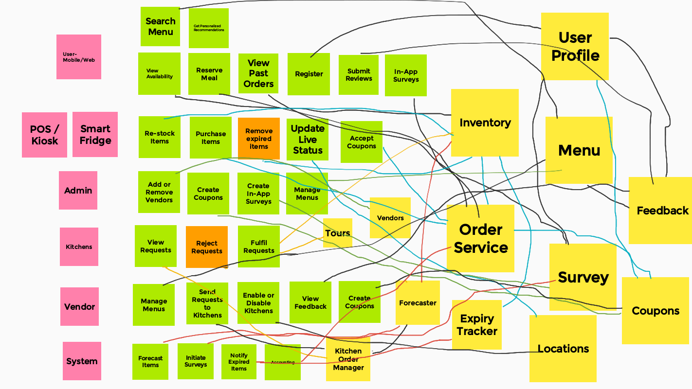

## Step 2
### Overall High-level Architecture

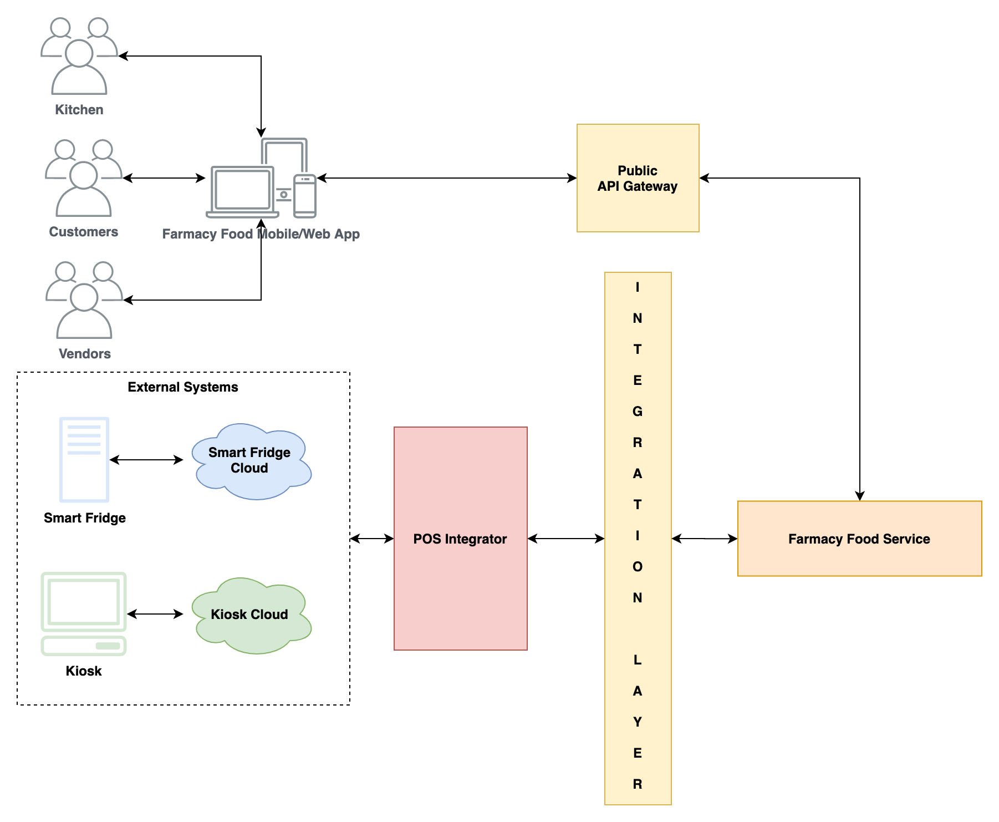

Architecture Approach for **Farmacy Food Service** - Decision Records
1. [Monolithic Design](adrs/monolithic-approach.md)
2. [Serverless Design](adrs/serverless-approach.md)

Moving ahead with the **Serverless design** for the Farmacy Food Service.

## Step 3
### Architecture of POS integration

Decision Record: [POS Integration Design](adrs/pos-integration.md)

## Step 4
### Component & Sequence Diagrams

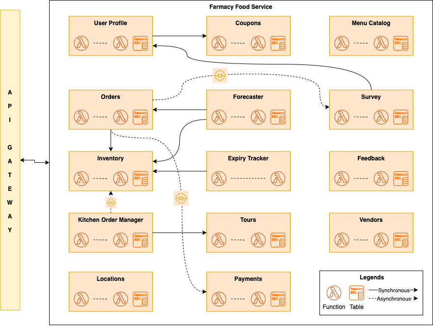

#### Vendor Registration

#### Kitchen Registration

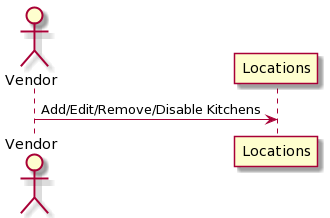

#### Adding Menu Items

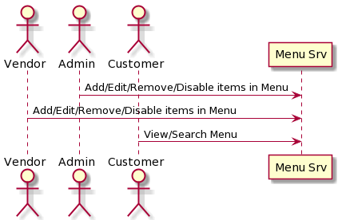

#### Kitchen Order Placement

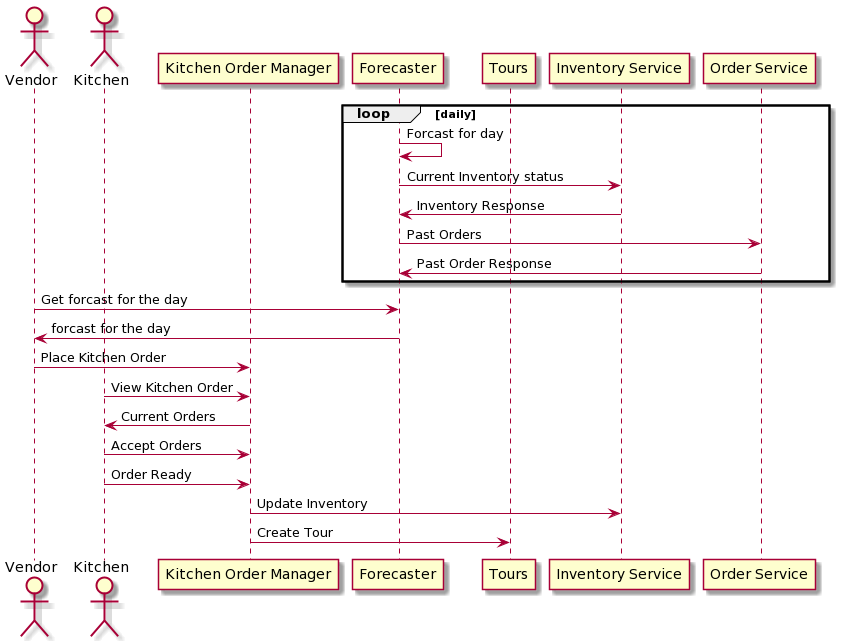

#### Expiry Tracker 

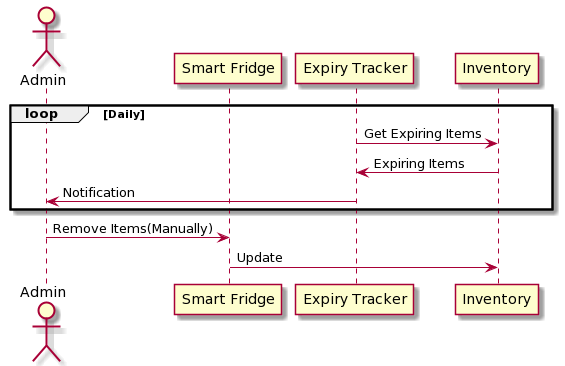

#### Online Order Reservations

Architecture Decisions:

[Inventory Updates Communicaiton](adrs/inventory-reservations.md)

[Payment Service Communication](adrs/payments-communication.md)

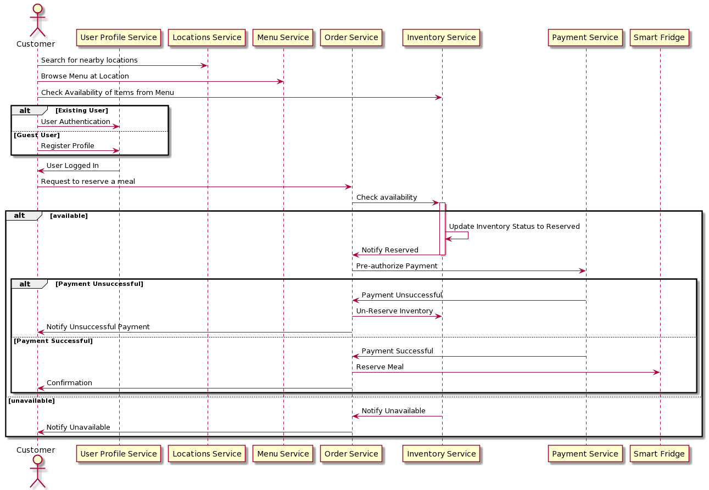

#### Purchasing Meal offline

Architecture Decisions:

[POS Integration](adrs/pos-integration.md)

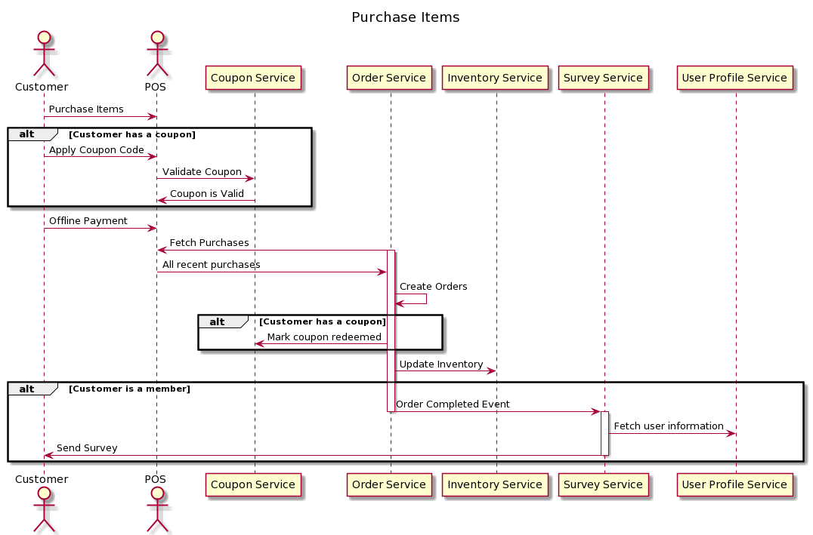

#### Create Surveys

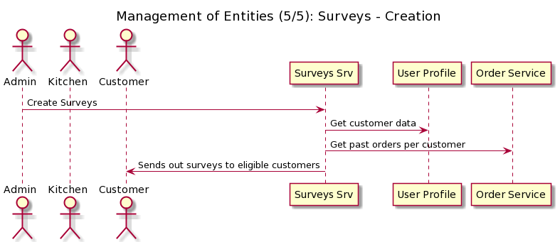

#### Create Coupons

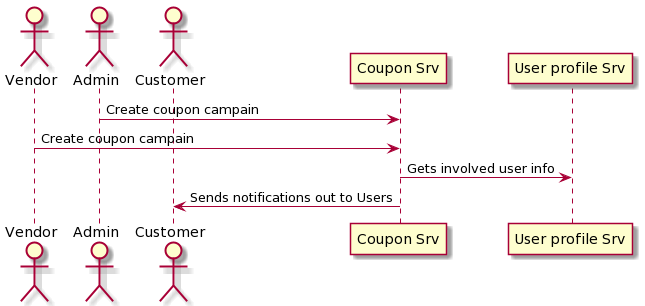

## Step 5
### Components Architecture Characteristics

| Component         | Description                                                                                                                                                    | Architecture Characteristics                                          |
|-------------------|----------------------------------------------------------------------------------------------------------------------------------------------------------------|-----------------------------------------------------------------------|
| Inventory         | As this is one of the system's core components, it need to be highly available,  provide necessary responses to other system services  in short time. | 1- Scalability 2- Performance 3- Availability 4- Reliability |
| Expiry Tracker | This job needs to run daily but should be  quick enough to analyze all items that are expired.                                                              | 1- Performance                                                        |
| Feedback          | This component is highly needed to render the menu, and thus needs to be highly available and performant.                                                   | 1- Performance 2- Availability 3- Customizable                  |
