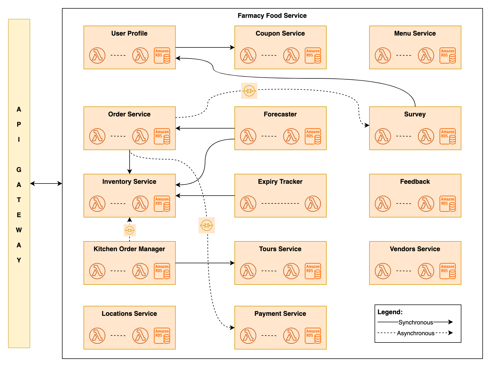

# Architecture Katas

## Step 1
### Identifying the Users/Clients
1. Customers
2. Vendors
3. Kitchens
4. Smart Fridges
5. Kiosk / POS Systems
6. Admin

### Identifying Use Cases and deriving components

## Step 2
### Overall High-level Architecture

Architecture Approach - Decision Records
1. [Monolithic Design](adrs/monolithic-approach.md)
2. [Serverless Design](adrs/serverless-approach.md)

Moving ahead with the **Serverless design** for the Farmacy Food Service.

## Step 3
### Architecture of POS integration

Decision Record: [POS Integration Design](adrs/pos-integration.md)

## Step 4
### Component & Sequence Diagrams

